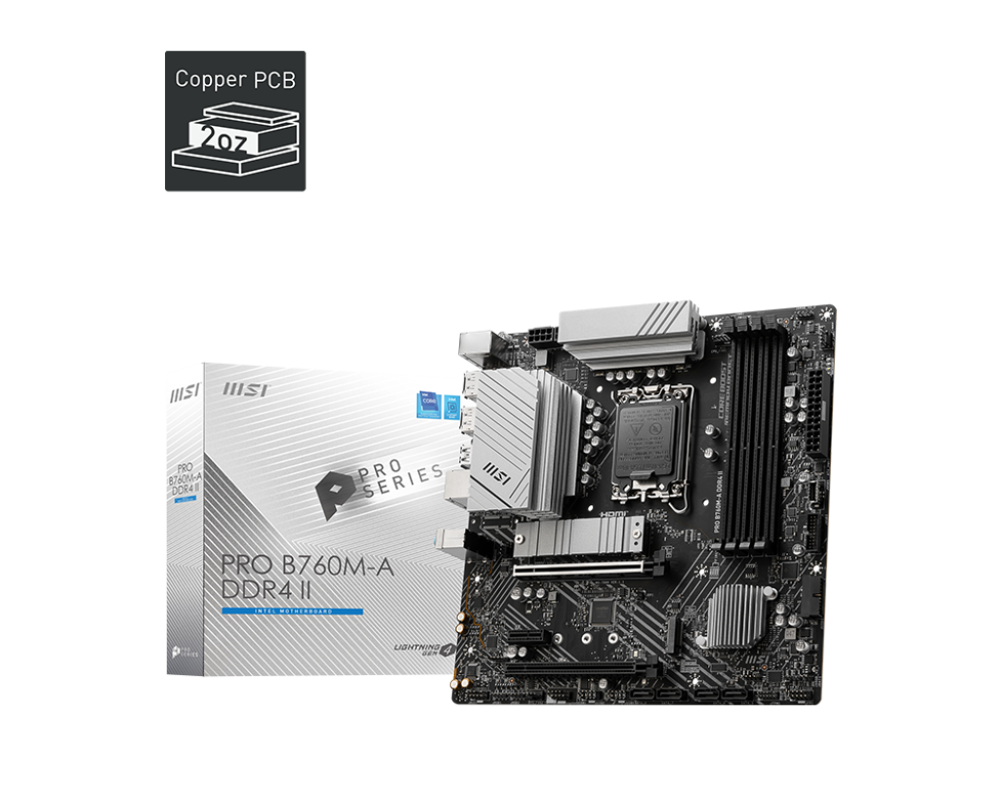

# Hackintosh MSI Pro B760M-A WIFI DDR4 II OpenCore EFI

Hackintosh OpenCore EFI for MSI Pro B760M-A WIFI DDR4 II + i5-12600kf + Gigabyte Radeon RX 6600 XT Gaming OC 8G



### [ENGLISH](README.EN.md)

### 软件版本

- [OpenCore 1.0.0](https://github.com/acidanthera/OpenCorePkg)
- macOS Sonoma 14.5 (23F79)

### 硬件

- 主板: 微星 MSI Pro B760M-A WIFI DDR4 II (2 Gen)
- BIOS版本: 7D99v1A 2024-04-23
- 处理器: Intel i5-12600KF
- 显卡: 技嘉 Radeon RX 6600 XT Gaming OC 8G (Display as AMD Radeon Pro W6600X 8 GB)
- 内存: 金百达银爵 KINGBANK 64GB DDR4 3600 Mhz (32GBx2 XMP 4000Mhz)
- MacOS 硬盘: 海康威视 HIKVISION C2000 Pro 1TB
- Windows 硬盘: 凯侠 SD10 1TB (KIOXIA EXCERIA PLUS G3)
- 声卡: 瑞昱 Realtek ALC897
- 有线网卡: 瑞昱 Realtek RTL8125BG 2.5GbE LAN
- 无线网卡: 英特尔 Intel AX211 WIFI6E
- 处理器散热: 利明 PA120 SE Dual Tower Cooler
- 机箱:  孤勇者 M-ATX 常规版
- 电源:  玄武 550V4 650w

### BIOS设置

```
1.关闭安全启动
Settings
  |-- Security
     |-- Secure Boot
       |-- Secure Boot: Disabled

2.使用搜索功能查找并启用 D.T.M 
Search
  |-- D.T.M
    |-- D.T.M: Enabled

```

### 注意事项

 - 安装成功后必须使用 [OCAuxiliaryTools](https://github.com/ic005k/OCAuxiliaryTools) 生成你自己的 SMBIOS
