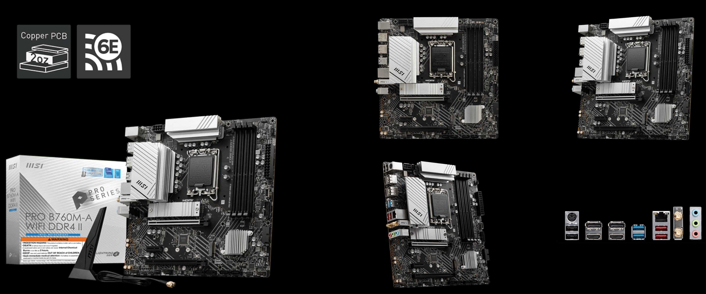

# Hackintosh MSI Pro B760M-A WIFI DDR4 II OpenCore EFI



### 硬件

- 主板: 微星 MSI Pro B760M-A WIFI DDR4 II (2 Gen) 

> [官方产品规格介绍](https://www.msi.cn/Motherboard/PRO-B760M-A-WIFI-DDR4-II/Overview)
> [官方驱动及软件下载](https://www.msi.cn/Motherboard/PRO-B760M-A-WIFI-DDR4-II/support#driver)

- BIOS 版本: 7D99v1A 2024-04-23

> 2024-08-01 发布新版 BIOS 7D99v1B ，更新内容：更新 CPU Microcode 0x125。

> 这个微码更新仅仅只能稍微减缓 13 14 代 CPU 的去世时间，并不能解决体质爆雷问题，用 13 14 代 CPU 的能退就退吧。
> 我使用的 12 代 CPU 暂时安全所以没有升级的必要。

- 处理器: Intel i5-12600KF
- 显卡: 技嘉 Radeon RX 6600 XT Gaming OC 8G (Display as AMD Radeon Pro W6600X 8 GB)
- 内存: 金百达银爵 KINGBANK 64GB DDR4 3600 Mhz (32GBx2 XMP 4000Mhz)
- MacOS 硬盘: 海康威视 HIKVISION C2000 Pro 1TB
- Windows 硬盘: 凯侠 SD10 1TB (KIOXIA EXCERIA PLUS G3)
- 声卡: 板载瑞昱 Realtek ALC897
- 有线网卡: 板载瑞昱 Realtek RTL8125BG 2.5GbE LAN
- 无线网卡: 板载英特尔 Intel AX211 WIFI6E

### 其他

- 显示器: 4k
- 散热: 双塔 Dual Tower Cooler
- 机箱: M-ATX
- 电源: 650w

### 软件版本

- [OpenCore 1.0.0](https://github.com/acidanthera/OpenCorePkg)
- macOS Sonoma 14.5 (23F79) [Thirdparty dmg download](https://hackintosh.club/d/10000080)

### BIOS 设置

```
1.关闭安全启动
Settings
  |-- Security
     |-- Secure Boot
       |-- Secure Boot: Disabled

2.使用搜索功能查找并启用 D.T.M
Search
  |-- D.T.M
    |-- D.T.M: Enabled

```

### 注意事项

- 安装成功后必须使用 [OCAuxiliaryTools](https://github.com/ic005k/OCAuxiliaryTools) 生成你自己的 SMBIOS


